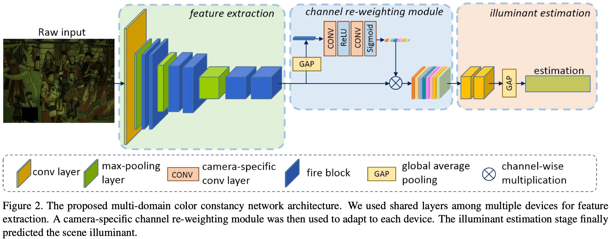

## PR1) Multi-Domain Learning for Accurate and Few-Shot Color Constancy

[PDF](https://openaccess.thecvf.com/content_CVPR_2020/papers/Xiao_Multi-Domain_Learning_for_Accurate_and_Few-Shot_Color_Constancy_CVPR_2020_paper.pdf)

### Model Architecture

### Objective

카메라마다 다른 센서를 사용하기 때문에 생겼던 CameraRGB space domain 문제를 Multi-Domain learning으로 해결하고자 함.
Multi-Domain learning의 핵심은 서로 다른 도메인의 데이터에 대해 하나의 Universal feature extractor로 피쳐 추출을 한다는 것이 특징인데, 이 모델에서도 해당 아이디어를 사용함.

### Novelty

- Color Constancy 문제에 Multi-Domain learning 사용
- Device-specific channel re-weighting module 사용
- Re-weighted Feature에 Shared illuminant estimator 사용

### Misc

- 디바이스마다 다르게 학습되는 Re-weighting module은 전체 모델 파라미터의 6.7% 뿐이므로 Few-shot learning task에도 적절함
- 단일 조명 CC 이기 때문에 GT illuminant chromaticity와 Angular Error를 잼
- 사용된 데이터셋은 reprocessed Gehler-Shi, NUS-8, Cube+